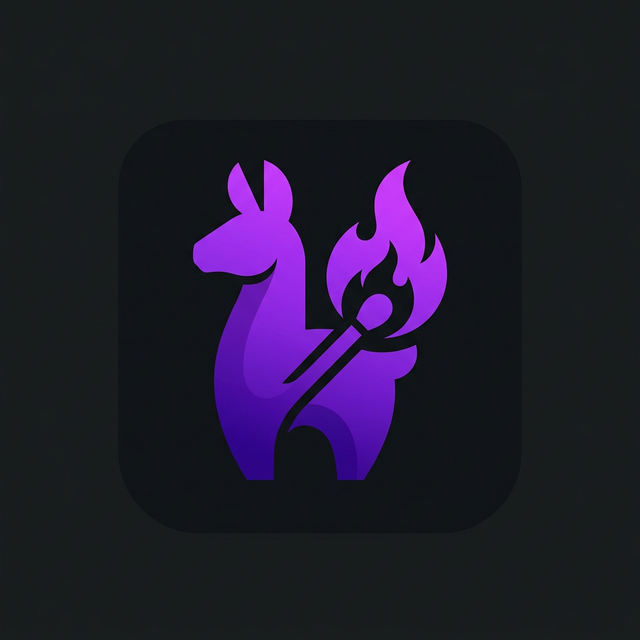

<div align="center">
  
  <h1>Ollamatch</h1>
  <p><strong>AI-powered job matching assistant — right in your browser.</strong></p>
  <p>
    
    
    
  </p>
</div>

---

Ollamatch is a Chrome extension that scrapes web pages, extracts text from images via OCR, parses your resume PDF, scores your fit against job descriptions, and generates tailored content — all powered by a **local Ollama LLM** with zero data leaving your machine.

## ✨ Features

| Feature | Description |
|---------|-------------|
| 🌐 **Webpage Scraping** | Auto-extracts text from any job posting or web page |
| 🖼️ **Image OCR** | Select page images and extract text using a vision model (LLaVA) |
| 📄 **PDF Parsing** | Upload your resume/CV and parse up to 4 pages client-side |
| 📊 **Match Scoring** | Get an AI-generated suitability score (0–100%) comparing your resume to the JD |
| ✍️ **Content Generation** | Generate cover letters, emails, or any text using all collected context |
| 🔒 **Fully Local** | All processing via local Ollama — your data never leaves your machine |

## 🧙 How It Works

Ollamatch uses a **4-step horizontal wizard**:

1. **Webpage** — Auto-scraped page content, editable
2. **Images** — Select images on the page to OCR (auto-skips if none found)
3. **Documents** — Upload a PDF resume; if a JD is detected, get a match score
4. **Generate** — Write a prompt and generate content using all previous context

Each step has a **refresh button** 🔄 so you can re-scrape after navigating to a new job.

## 🚀 Getting Started

### Prerequisites

- [Ollama](https://ollama.com) installed locally
- A text model pulled (e.g. `ollama pull llama3.2:3b`)
- A vision model for OCR (e.g. `ollama pull llava:latest`)

### Setup

1. **Start Ollama with CORS enabled:**

   **Windows (PowerShell):**
   ```powershell
   $env:OLLAMA_ORIGINS="*"; ollama serve
   ```

   **macOS / Linux:**
   ```bash
   OLLAMA_ORIGINS="*" ollama serve
   ```

2. **Install the extension:**
   ```bash
   git clone https://github.com/your-username/ollamatch.git
   cd ollamatch
   npm install
   npm run build
   ```

3. **Load in Chrome:**
   - Navigate to `chrome://extensions`
   - Enable **Developer mode**
   - Click **Load unpacked** → select the `dist/` folder

### Usage

- **Right-click** on any page → **Open Ollamatch**
- Or type `@ollamatch` in any text field
- Or click the extension icon for settings

## ⚙️ Configuration

Click the extension icon to configure:

| Setting | Default | Description |
|---------|---------|-------------|
| Ollama Endpoint | `http://localhost:11434` | Your Ollama server URL |
| Model | `llama3.2:3b` | Text generation model |
| Vision/OCR Model | `llava:latest` | Image text extraction model |
| Context Window | `4096` | Token limit (increase for longer documents) |

## 🏗️ Tech Stack

- **React** + **TypeScript** — UI components
- **Vite** + **CRXJS** — Build tooling for Chrome extensions
- **Tailwind CSS** — Styling
- **Ollama** — Local LLM inference
- **PDF.js** — Client-side PDF parsing
- **Lucide React** — Icons
- **Mozilla Readability** — Web page text extraction

## 📁 Project Structure

```
src/
├── assets/            # Logo and static assets
├── background/        # Service worker (Ollama proxy, context menu)
├── components/        # AssistantApp wizard UI
├── content/           # Content script (injection, triggers)
├── hooks/             # useLLM React hook
├── popup/             # Extension popup settings page
└── services/
    ├── llm/           # LLM provider abstraction (Ollama)
    └── pageScraper.ts # Page text & image extraction
```

## 📄 License

MIT

---

<div align="center">
  <sub>Built with ❤️ using Ollama + React + TypeScript</sub>
</div>
